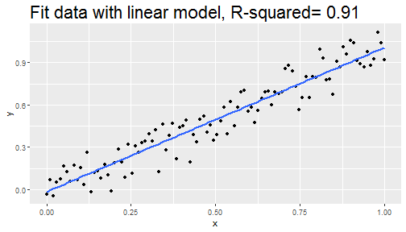
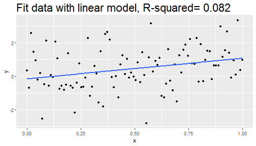

## This is a Shiny app.
		
- Linear regressions are most commonly used to create complex models.
- Data measurements always have some associated noise.
- It is important to understand how the noise effects the fit quality.

### <b>
This Shiny app helps to visualize the effect of Gaussian random noise.
### </b>

---

## Instructions and guidelines

The objective is to fit the following expression with a linear model:
$$y_i=x_i + \varepsilon_i \qquad \text{for}~i = 1,\dots,n$$

where $\varepsilon_i =  \mathcal{N}(\mu, \sigma)~\text{for}~i = 1,\dots,n$.

### <b> 
We provide the user with three inputs: 
### </b>
- the number of points $n$ (measurements);
- the mean of the Gaussian random noise, $\mu$;
- the standard deviation of the Gaussian random noise, $\sigma$.

The linear model is illustrated via a plot and the $R^2$ value is
provided as a measure of the quality of the fit.

---

## With $n=100$, $\mu=0$, and $\sigma = 0.1$, the quality of the fit is good.


```
## Loading required package: ggplot2
```


```r
fit <- lm(y ~ x, data = df)
r2 <- summary(fit)$r.squared
ggplot(df, aes(x,y)) +
    geom_point() + geom_smooth(method = "lm", se = FALSE)+
    ggtitle(paste("Fit data with linear model, R-squared=", format(r2,digits=2))) +
    theme(plot.title = element_text(size=22))
```



---

## If $\sigma$ = $1.2$, $R^2$ is low (poor fit).


```r
fit <- lm(y ~ x, data = df)
r2 <- summary(fit)$r.squared
ggplot(df, aes(x,y)) +
    geom_point() + geom_smooth(method = "lm", se = FALSE) +
    ggtitle(paste("Fit data with linear model, R-squared=", format(r2,digits=2))) +
    theme(plot.title = element_text(size=22))
```




